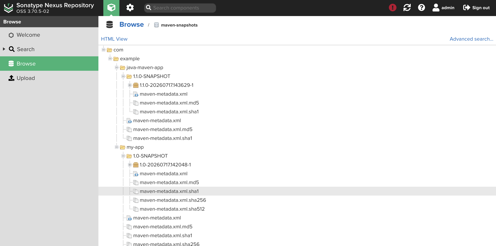

# Artifact Repository Manager with Nexus

This project is for the DevOps Bootcamp demo for:

Artifact Repository Manager with Nexus - [DevOps Bootcamp](https://techworld-with-nana.teachable.com/p/devops-bootcamp)

## Demo Project

Run Nexus on Droplet and Publish Artifact to Nexus

## Technologies used

Nexus, DigitalOcean, Linux, Java, Gradle, Maven

## Project Description

- Install and configure Nexus from scratch on a cloud server
- Create new User on Nexus with relevant permissions
- Java Gradle Project: Build Jar & Upload to Nexus
- Java Maven Project: Build Jar & Upload to Nexus

## Implementation

### Create Server on DigitalOcean

Create a droplet on DigitalOcean with at least 4GB RAM / 2 CPUs to avoid performance issues. Configure the Firewall to allow SSH access on port 22.

```bash
# SSH as root
ssh root@x.x.x.x

# Create administrator user
adduser administrator

# Add to sudo group
usermod -aG sudo administrator

# Exit
exit

# Reconnect
ssh administrator@x.x.x.x
```

### Install Prerequisites and Download Nexus

Install Java 17 & download nexus tar file

```bash
# Update packages
sudo apt update

# Install netstat (net-tools), Java 17 JRE and wget
sudo apt install -y net-tools openjdk-17-jre-headless wget

# Verify Java
java -version

# Go to /opt
cd /opt

# Download Nexus
sudo wget https://download.sonatype.com/nexus/3/nexus-3.77.0-08-unix.tar.gz

# Extract
sudo tar -xzf nexus-3.77.0-08-unix.tar.gz
```

### Create Nexus service account

Create a new user to run the application (security best practice)

```bash
sudo adduser nexus

sudo chown -R nexus:nexus /opt/nexus-3.77.0-08
sudo chown -R nexus:nexus /opt/sonatype-work
```

### Run Nexus

Switch to the newly created user to run the application. Update the config files to run the application with the "nexus" user

```bash
sudo su - nexus

vim /opt/nexus-3.77.0-08/bin/nexus.rc       # run_as_user="nexus"

# Start Nexus
/opt/nexus-3.77.0-08/bin/nexus start
```

> **Reminder:** Open TCP port **8081** in your firewall to allow the traffic.

### Login to Nexus

Navigate to the browser url `http://x.x.x.x:8081`. Use the default credentials to signin, username is "admin"

```bash
# password in below file
sudo cat /opt/sonatype-work/nexus3/admin.password
```

After login, change the password when prompted.

### Create Nexus User to Upload the Artifact Files

In the Nexus UI:

1. **Security → Roles → Create role**
2. Role ID: `nx-java-role`
3. Grant privilege giving **All privileges for maven-snapshots repository views** access to the **maven-snapshots** repository.
4. Save.

Then:

1. **Security → Users → Create local user**
2. Username: `appuser`
3. Set password.
4. Assign role: `nx-java-role`
5. Save.

### Build JAR & Upload to Nexus

The repository contains 2 Java projects "java-app" which uses gradle build tool & "java-maven-app" which uses maven for build.

#### Gradle

Add the `maven-publish` plugin to deploy the artifacts to Nexus. In "build.gradle" file add the following

```json
apply plugin: 'maven-publish'

publishing {
    publications {
        maven(MavenPublication) {
            artifact("build/libs/my-app-$version"+".jar"){
                extension 'jar'
            }
        }
    }

    repositories {
        maven {
            name 'nexus'
            url "http://x.x.x.x:8081/repository/maven-snapshots/" 
            allowInsecureProtocol = true
            credentials {
                username project.repoUser
                password project.repoPassword
            }
        }
    }
}
```

Add the Nexus user credentials in the "gradle.properties" file

```ini
repoUser = username
repoPassword = password
```

Run the following commands to generate the artifacts & publish them to Nexus

```bash
gradle build
gradle publish
```

#### Maven

In "pom.xml" file add the following 

```xml
    <distributionManagement>
        <snapshotRepository>
            <id>nexus-snapshots</id>
            <url>http://x.x.x.x:8081/repository/maven-snapshots</url>
        </snapshotRepository>
    </distributionManagement>
```

In "home" directory add ".m2/settings.xml" file to store the Nexus user credentials

```xml
<settings>
  <servers>
    <server>
      <id>nexus-snapshots</id>
      <username>username</username>
      <password>password</password>
    </server>
  </servers>
</settings>
```

Run the following commands to generate the artifacts & publish them to Nexus

```bash
mvn package
mvn deploy
```

Checkout the `maven-snapshots` repository in the browser & see the uploaded artifacts.



### Configure systemd

Optionally you can run Nexus as a systemd service. Create `/etc/systemd/system/nexus.service`

```ini
[Unit]
Description=Nexus Repository Manager
After=network.target

[Service]
Type=forking
User=nexus
Group=nexus
LimitNOFILE=65536
ExecStart=/opt/nexus-3.77.0-08/bin/nexus start
ExecStop=/opt/nexus-3.77.0-08/bin/nexus stop
Restart=on-abort

[Install]
WantedBy=multi-user.target
```

Reload the service daemon & enable Nexus

```bash
sudo systemctl daemon-reload
sudo systemctl enable nexus

# Verify
sudo systemctl start nexus
sudo systemctl status nexus
netstat -tulpn | grep 8081
```

### Extra

Nexus have a REST api interface that can be used to query the repositories & to integration with automation tools

```bash
curl -u username:password -X GET "http://x.x.x.x:8081/service/rest/v1/components?repository=maven-releases"

curl -u username:password -X GET "http://x.x.x.x:8081/service/rest/v1/repositories"
```

Nexus also support "Cleanup Policies" with can be set to cleanup the old artifacts. The policy will mark the files for deletion & "Compact blob store" task will run to remove the files from the blob store.